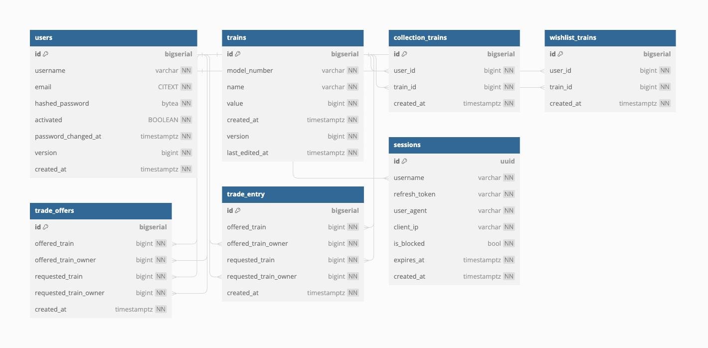

# MerolaStation App for Lionel Train Collectors 

# Introduction
MerolaStation is a train collection management system, providing features for tracking and managing train collections, wishlists, trade offers, and user profiles. Built with Go, it utilizes technologies like PostgreSQL, Docker, Kubernetes, and AWS.

# Features
## Collection Management:
Create, list, and delete trains from a user's collection. 
Update the value of a train in the collection.

## Wishlist Management:
Add and delete trains from a user's wishlist.

## Trade Offers and Transactions:
Create, view, list, and delete trade offers between users for trains within each user's collection. 
Create trade transactions -- implemented as a db transaction to ensure ACID properties.
Views history of trade transactions for a user

## User Management:
User creation, login, and authentication with token handling.
List and retrieve user profiles.

## Technologies Used:
Backend Language: Go
Database: PostgreSQL
Containerization: Docker
Orchestration: Kubernetes
Deployment: AWS (RDS, EC2, EKS, Secrets)
CI/CD: GitHub Actions

# Installation and Setup
## Clone the Repository:
```git clone https://github.com/PlatosCodes/MerolaStation.git```

## Build Docker Image
```docker build -t merolastation .```

## Run with Docker Compose
```docker-compose up```

# Architecture


# Testing
```make test```

# Future Improvements
Coming soon

# Author
Alexander Merola, ammerola@gmail.com, linkedin.com/in/alexander-merola

# Acknowledgements
Put resources as well as third-party packages and their documentation, etc.
